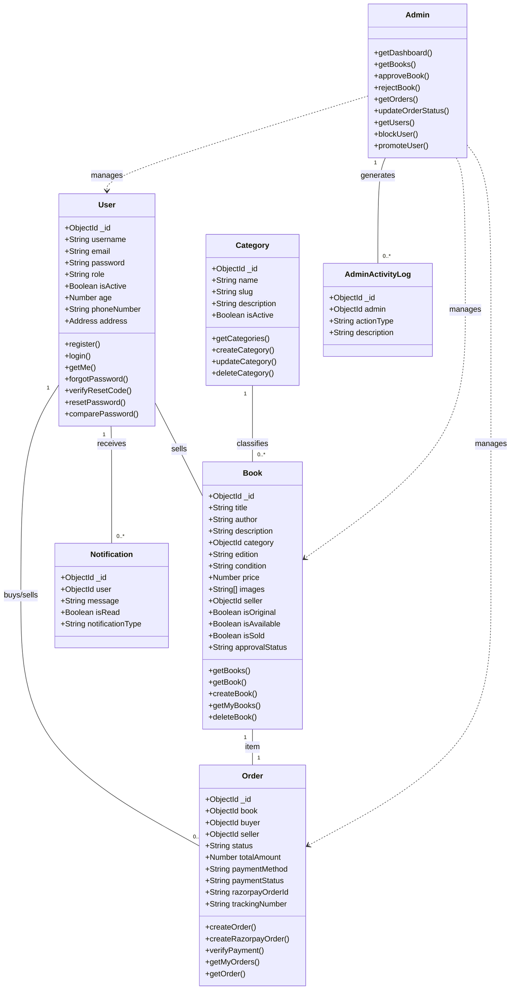
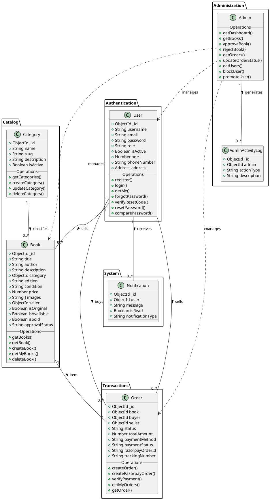

# BookBridge Class Diagram

This document contains the class diagram for the BookBridge application, representing the MongoDB schemas and their associated operations (controllers).

## Mermaid Diagram (Rendered in Viewer)

## PlantUML Code

If you prefer a standard UML visualizer, you can copy the code below into a [PlantUML Editor](https://www.planttext.com/).

## Schema Details

### User
Represents a registered user of the platform.
- **role**: Can be 'user' or 'admin'.
- **address**: Embedded delivery address details.

### Book
Represents a book listed for sale.
- **condition**: 'new', 'like_new', 'used'.
- **approvalStatus**: 'pending', 'approved', 'rejected'.
- **isOriginal**: Flag for admin-listed original books.

### Order
Represents a transaction between a buyer and a seller for a specific book.
- **status**: 'available', 'sold', 'picked_up', 'in_transit', 'delivered', 'cancelled'.
- **paymentMethod**: 'cod', 'online'.

### Category
Represents book categories (e.g., Fiction, Academic).

### Notification
System notifications for users regarding orders, approvals, etc.

### AdminActivityLog
Audit log for administrative actions.
