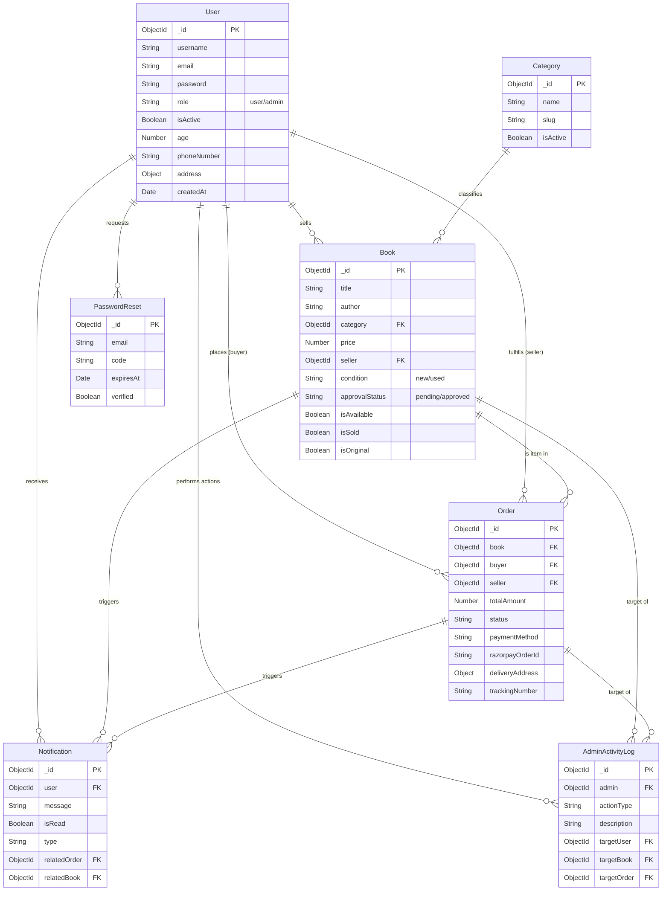
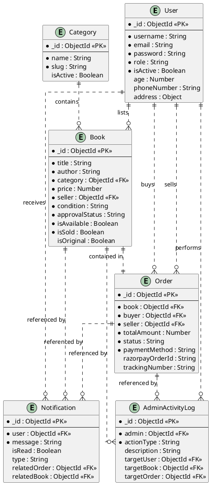

# BookBridge ER Diagram

This document contains the Entity-Relationship (ER) diagram for the BookBridge application, representing the database schema structure and relationships between entities.

## Mermaid ER Diagram

## PlantUML Code (Crow's Foot Notation)

Copy the code below into a [PlantUML Editor](https://www.planttext.com/) to generate a professional Entity-Relationship diagram.

## Entity Descriptions

1.  **User**: Central entity. Can be a standard user (buyer/seller) or an admin.
2.  **Book**: Product entity. Linked to a `Category` and a `Seller` (User).
3.  **Order**: Transaction entity. Connects a `Buyer`, `Seller`, and a specific `Book`.
    *   *Note*: Each order document corresponds to a single book item to simplify status tracking per item.
4.  **Category**: Classification for books (e.g., Fiction, Education).
5.  **Notification**: Alerts for users about order updates or approvals.
6.  **AdminActivityLog**: Audit trail for admin actions.
