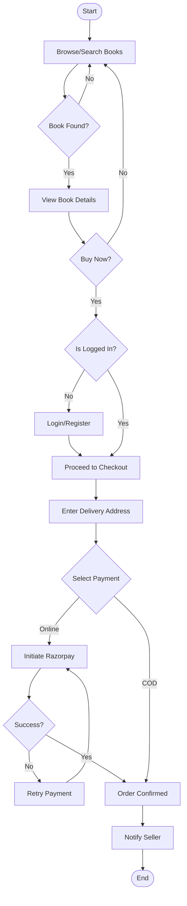
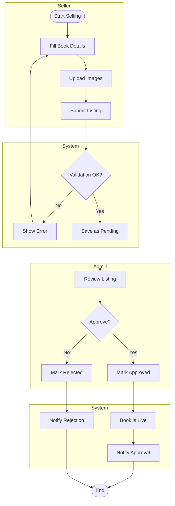
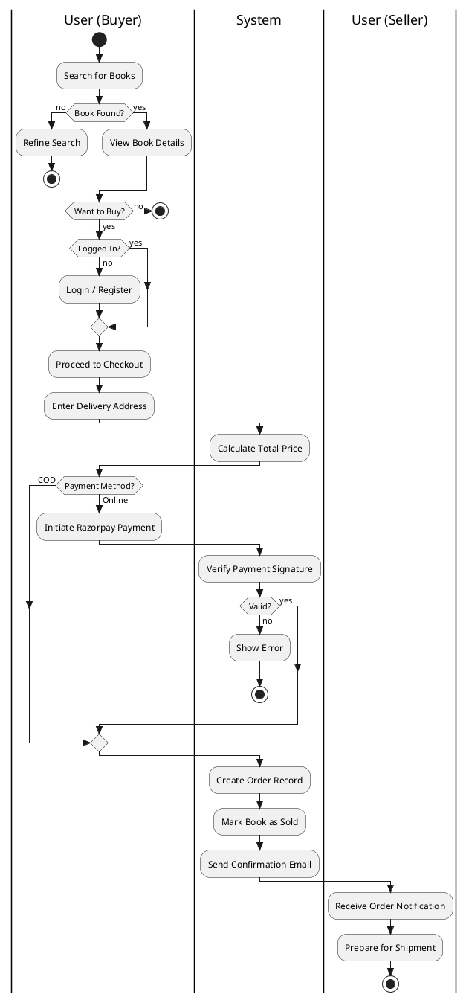
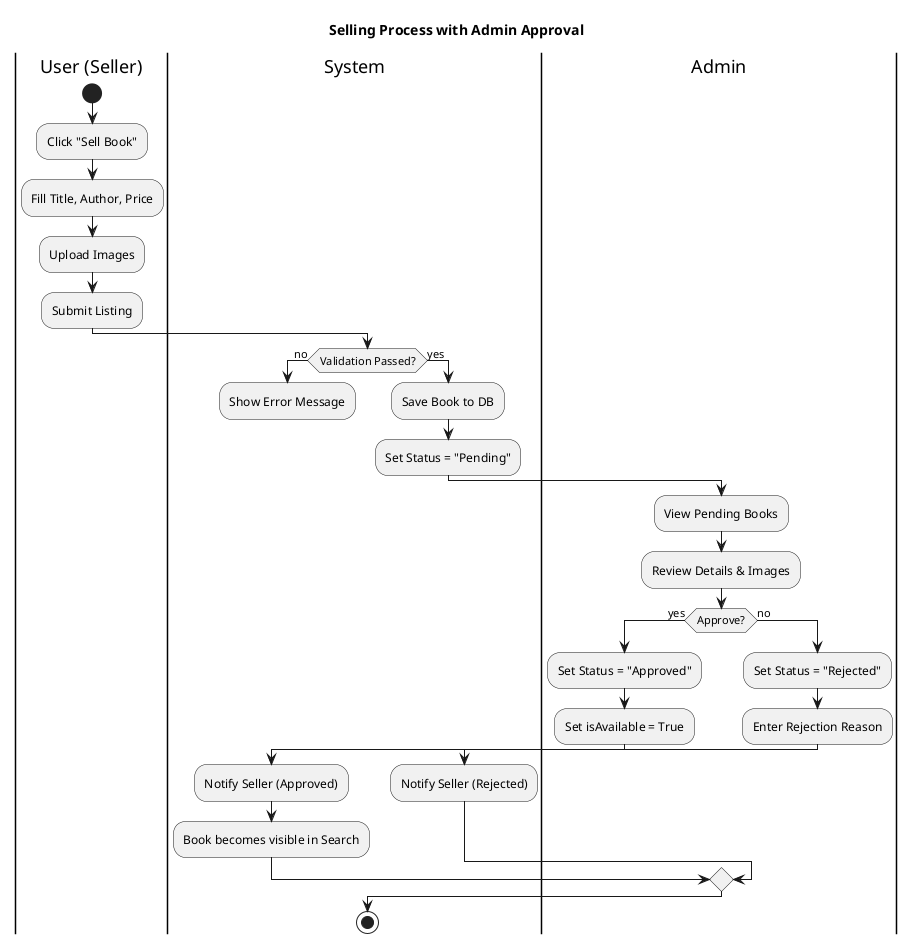

# BookBridge Activity Diagram

This document contains the Activity Diagram for the BookBridge application, illustrating the flow of control for key processes like Buying and Selling.

## 1. Buying Process (Flowchart)

## 2. Selling & Approval Process (Swimlanes)

## PlantUML Code (Swimlane Activity Diagram)

Copy the code below into a [PlantUML Editor](https://www.planttext.com/) for a professional swimlane diagram covering the entire lifecycle.

