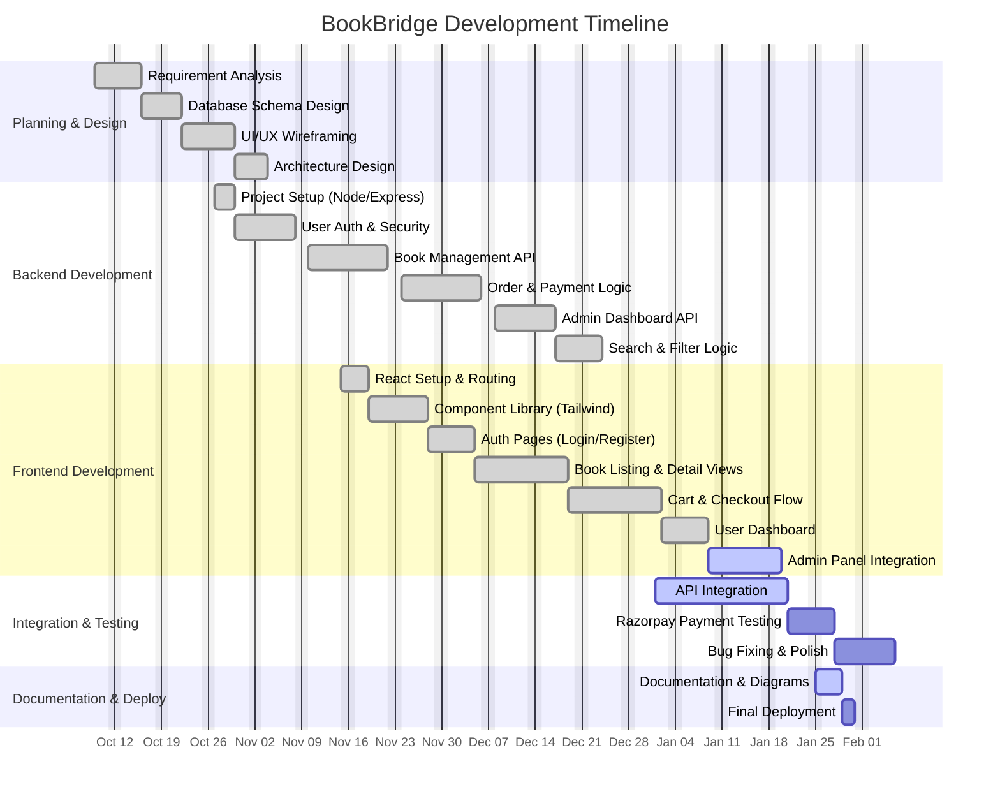

# BookBridge Project Gantt Chart

This document outlines the authentic development timeline for the BookBridge MERN stack application, spanning from October 9th, 2025 to January 31st, 2026.

## Timeline Breakdown

### 1. Planning Phase (Oct 9 - Oct 31)
*   **Kickoff (Oct 9)**: Started requirement gathering.
*   **Design**: Spent ~3 weeks finalizing database schemas and UI wireframes before coding.

### 2. Backend Development (Late Oct - Mid Dec)
*   **Core Logic**: Heavy development focus in November for Book CRUD and Auth.
*   **Complex Features**: December was dedicated to Order management and Razorpay integration logic.

### 3. Frontend Development (Mid Nov - Mid Jan)
*   **Parallel Development**: Frontend started once core Backend APIs were stable.
*   **UI Implementation**: Built responsive pages using Tailwind CSS throughout December and January.

### 4. Integration & Testing (Jan 2026)
*   **Integration**: Connecting React to Express, handling API errors.
*   **Testing**: Rigorous testing of payment gateways and user flows in late January.

### 5. Final Delivery (End of Jan)
*   **Documentation**: Creating technical diagrams (Class, Sequence, Activity) and manuals.
*   **Launch**: Scheduled for Jan 31st, 2026.
