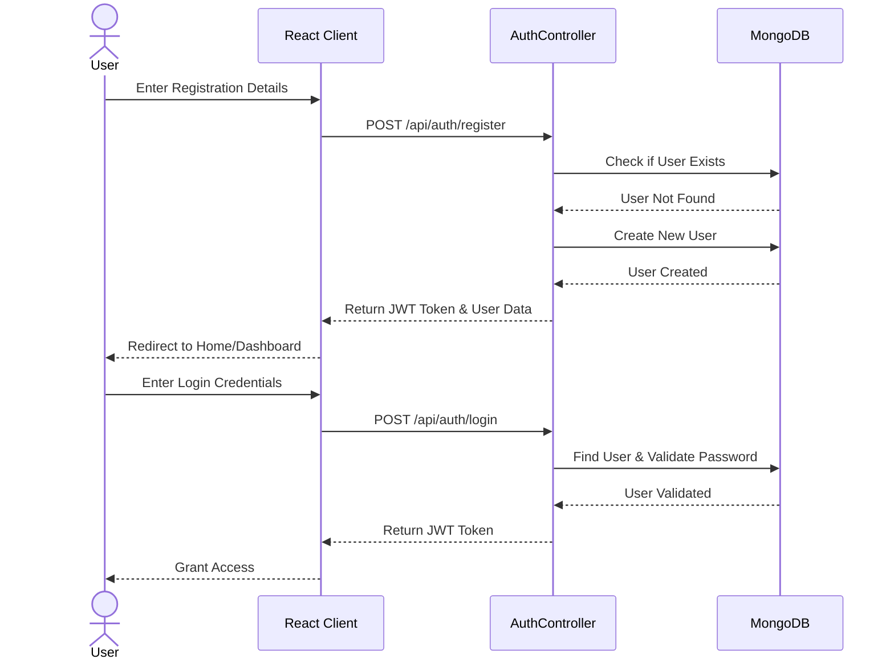
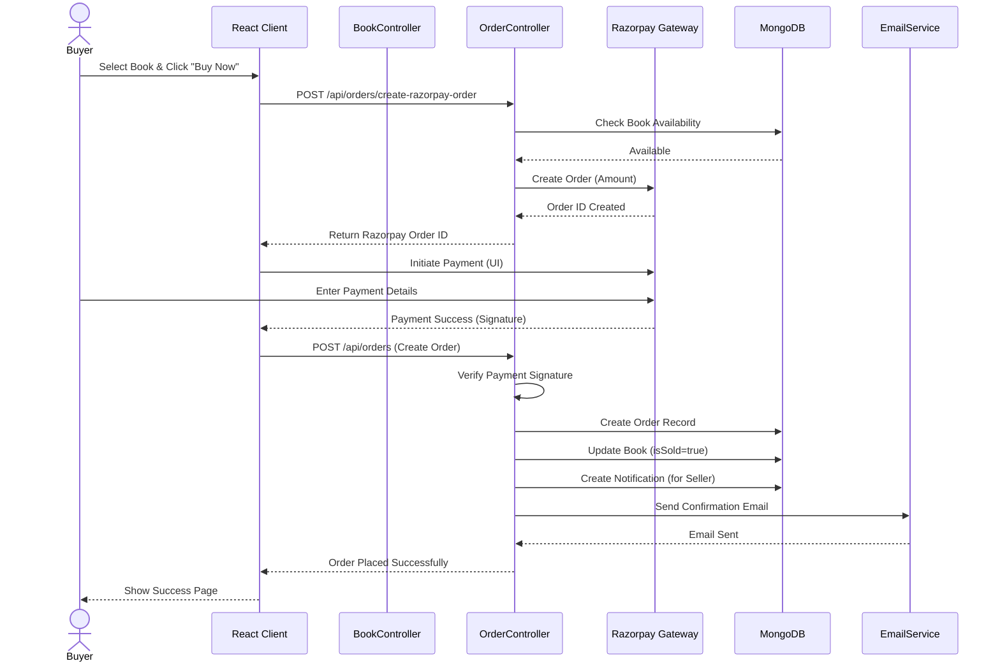
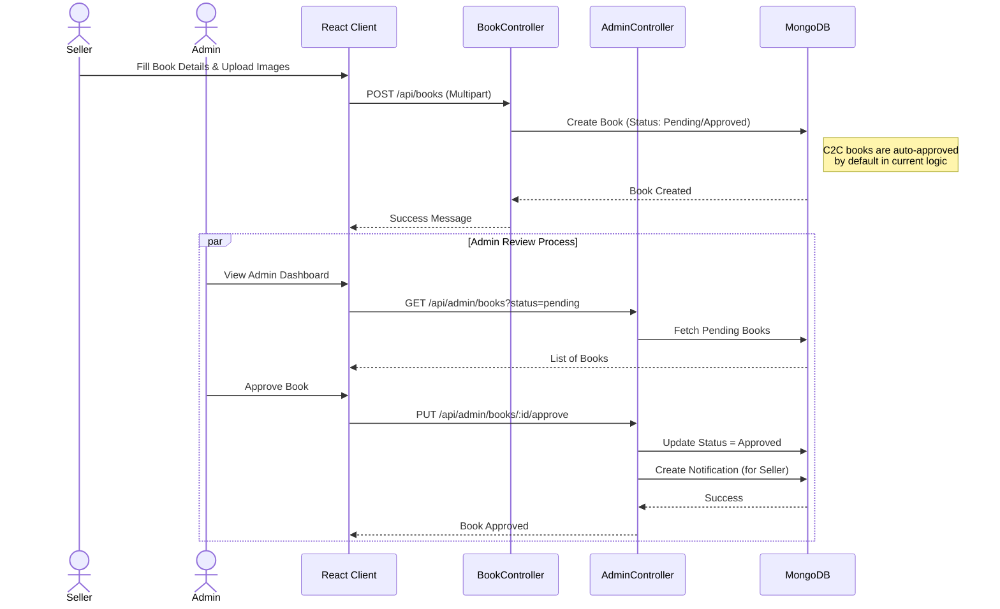
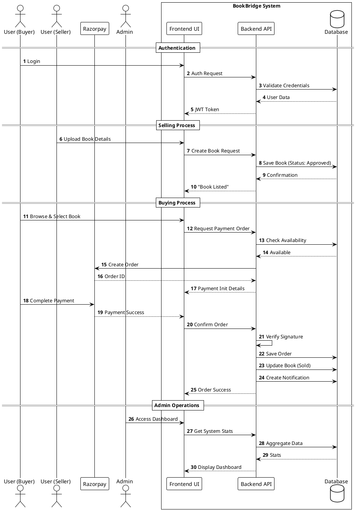

# BookBridge Sequence Diagrams

This document contains sequence diagrams for the core workflows of the BookBridge application.

## 1. User Registration & Authentication Flow

## 2. Book Purchase Flow (End-to-End)

## 3. Selling & Admin Approval Flow

## PlantUML Version (For Visual Style)

Copy the code below into a [PlantUML Editor](https://www.planttext.com/) to generate a diagram matching your example style.

