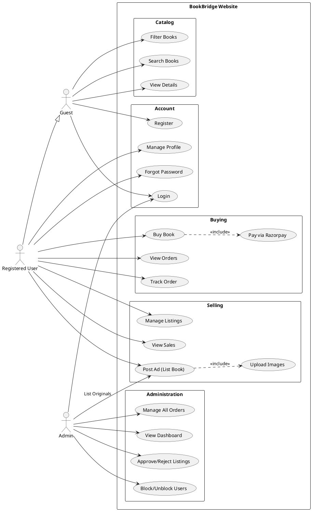

# BookBridge Use Case Diagram

This document contains the Use Case diagram for the BookBridge application, illustrating the interactions between different actors (Guest, User, Admin) and the system functionalities.

## Mermaid Diagram

```mermaid
usecaseDiagram
    actor "Guest" as Guest
    actor "Registered User" as User
    actor "Admin" as Admin

    package "BookBridge System" {
        %% Account Management
        usecase "Register" as UC1
        usecase "Login" as UC2
        usecase "Manage Profile" as UC3
        usecase "Reset Password" as UC4

        %% Browsing & Discovery
        usecase "Search Books" as UC5
        usecase "View Book Details" as UC6
        usecase "Filter by Category/Price" as UC7

        %% Buying
        usecase "Add to Cart/Buy Now" as UC8
        usecase "Make Payment (Razorpay)" as UC9
        usecase "View Order History" as UC10
        usecase "Track Order Status" as UC11

        %% Selling
        usecase "List Book for Sale" as UC12
        usecase "Upload Book Images" as UC13
        usecase "Manage My Listings" as UC14
        usecase "Delete Book" as UC15

        %% Administration
        usecase "View Dashboard Stats" as UC16
        usecase "Approve/Reject Books" as UC17
        usecase "Manage Users (Block/Unblock)" as UC18
        usecase "Manage Orders" as UC19
    }

    %% Relationships
    Guest --> UC1
    Guest --> UC2
    Guest --> UC5
    Guest --> UC6
    Guest --> UC7

    User --|> Guest : inherits

    User --> UC3
    User --> UC4
    User --> UC8
    User --> UC9
    User --> UC10
    User --> UC11
    User --> UC12
    User --> UC13
    User --> UC14
    User --> UC15

    %% Include/Extend relationships
    UC8 ..> UC9 : <<include>>
    UC12 ..> UC13 : <<include>>
    UC14 ..> UC15 : <<extend>>

    Admin --> UC2
    Admin --> UC16
    Admin --> UC17
    Admin --> UC18
    Admin --> UC19
    Admin --> UC12 : List Originals (B2C)
```

## PlantUML Code

Copy the code below into a [PlantUML Editor](https://www.planttext.com/) for a standard UML visual representation.



## Actors & Roles

1.  **Guest**: Unregistered visitor. Can browse, search, and view books, but must register/login to buy or sell.
2.  **Registered User**: Can act as both **Buyer** and **Seller**.
    *   **As Buyer**: Purchase books, track orders, view history.
    *   **As Seller**: List used books, manage listings, view sold items.
3.  **Admin**: Platform manager.
    *   Approves/Rejects user listings.
    *   Manages users (ban/promote).
    *   Lists "Original" books (B2C model).
    *   Views platform analytics.
